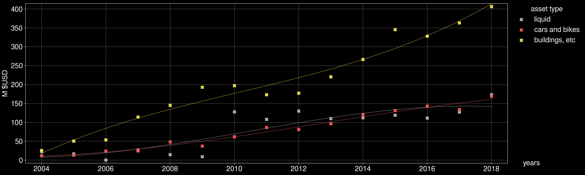

# presentation-toolkit
This software repository aims to provide CLI-based tools to facilitate preparation of presentations.

**It differs from other alternatives since this software tries to follow the [UNIX philosophy](http://www.linfo.org/unix_philosophy.html) as close as possible while still allowing the end result to look nice and pleasant to the eye.**

These tools work on Linux, but can be made to work on other platforms too with some or a lot of effort (depending on the tool).

All pull requests and issues welcome.


#### Here's a quick guide to get you started in life (try some of these out!)
```
echo 42 | chart pie
( echo 42 the answer; echo 113 ; echo 69) | chart barcount noheader
wc -l /etc/* | sort -nr |chart barcount noheader
cat /proc/vmstat | sort -k2 -nr | head -10 | chart bar noheader
(echo -n param; cat /proc/interrupts)  |chart bar ignoreextra
netstat -tu|grep :|awk '{print $5"/"$1}' |sort | uniq -c | sort -nr | tr : \  |chart summarybar noheader

dd if=/dev/urandom count=1000 | tr -dc 0-9 | sed -E 's/(..).(...).(...)./\1 \2 \3\n/g' | head -15 | chart plotscatter grid noheader cubefit dark
dd if=/dev/urandom count=1000 | tr -dc 0-9 | sed -E 's/(..).(...).(...)./\1 \2 \3\n/g' | head -15 | chart sidebar noheader squarefit overlay dark
dd if=/dev/urandom count=1000 | tr -dc 0-9 | sed -E 's/(..).(...).(...)./\1 \2 \3\n/g' | head -15 | chart pie /tmp/test.png noheader dark show
image-invert /tmp/test.png 
termshot /tmp/test2.png hexcolordump -as /tmp/test.png 
```

Take a look at [nice output images](./tests/out/) and [respective input samples](./tests/in/) to continue your quick-start tour. Those are used for regression testing, but are super useful to learn to use the tools (not that they need any learning).




### Is there anything else?
Yes!

https://github.com/FireyFly/pixd

https://github.com/0ki/binGraph

https://github.com/cortesi/scurve/blob/master/binvis


### Tips and tricks:
* General speaking tips and tricks

https://twitter.com/jesslynnrose/status/1041242744998572032

* Having the same terminal on your extended screen for the beamer
1. terminal 1: `screen -S presenting`
1. terminal 2: `screen -x presenting`
1. move one of the terminals to the other screen
Thanks to @leyrer & @MacLemon
